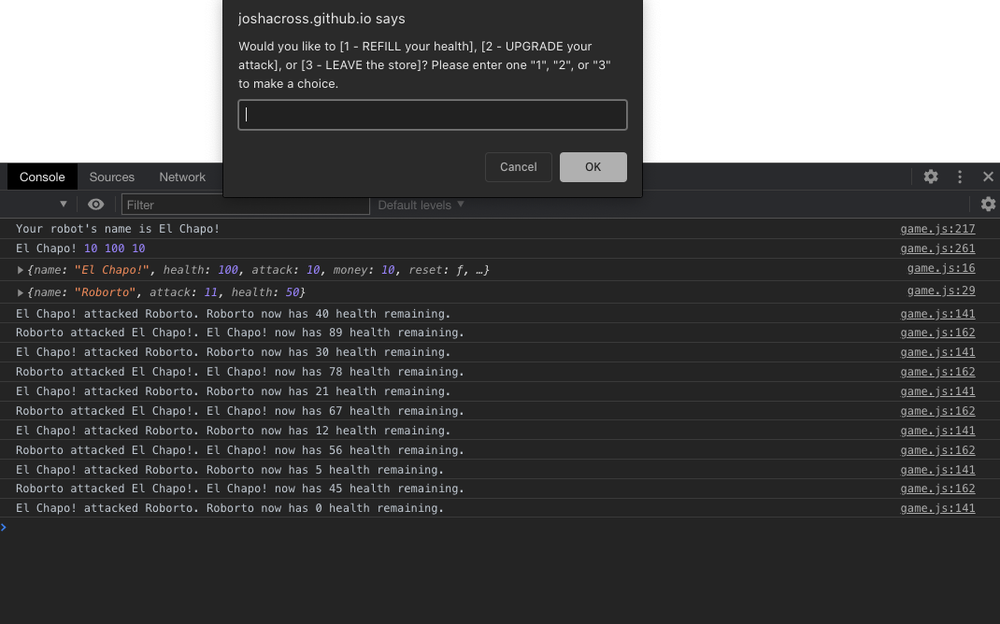

# robot-gladiators

## Description
A fully-functioning, pure 1-player Javascript robot battle game fought in the browser console using window prompts that feature start, fight, shop, and endgame functions.

In order to win the game, player must strategically defeat all enemy robots without their robot dying. High score is stored in localStorage until player attains a new high score. 

## Features

* Stored player and enemy stats using object properties and methods

* Utilized Math.random () to create a 50/50 coin-toss variable on who goes first, and to randomize enemy statistics

* Data validation of player input using recursive functions

* Control flow statements - For and While loops, directing operation order and application behavior

* Invoked functions at desired locations:
    * Isolated potential bugs and data variables
    * Refractored code to be less repetitive and abstract
    * Increased control over application's actions.

* Data is stored and manipulated using primitive data types

* Time management and focus by tracking bugs and feature requests in GitHub issues panel

## Website
https://joshacross.github.io/robot-gladiators/
## Reference Images

